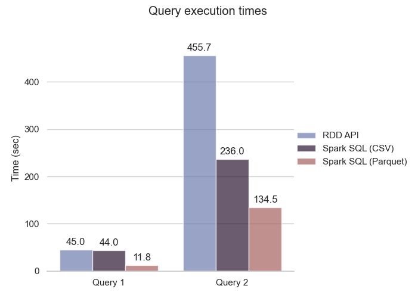

# PySpark Big Data Project
A group project for my MSc course 'Big Data Management' developed on a remote VM provided by <https://okeanos.grnet.gr/home/>. 

The first part of the project includes experimentation with different APIs and file formats of PySpark for accessing data and executing queries. The second part focuses on text classification with SparkML using TF-IDF calculated with map-reduce. 

The project's 'report.pdf' provides full details.

#### Example figure

